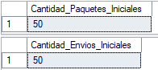
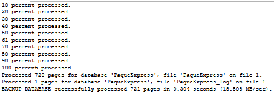
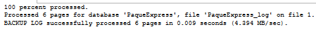
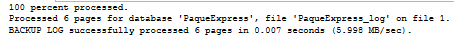
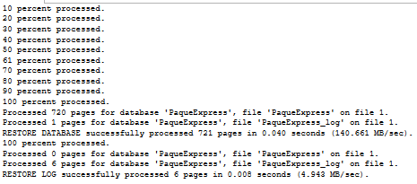
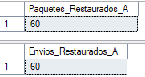
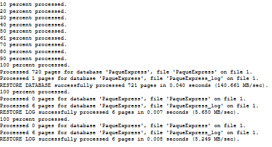
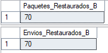

# Proyecto de Estudio

# PRESENTACIÓN - PaqueExpress

**Asignatura**: Bases de Datos I (FaCENA-UNNE)

**Integrantes**:

- Arnica, Saul Agustin (L.U.: 60.457 – DNI: 43.205.368)
- Miño Gomez, Juan Daniel (L.U.: 58.033 – DNI: 38.963.397)
- Morales Lopez, Luana Belen (L.U.: 57.983 – DNI: 46.460.672)
- Navarro Acevedo, Sergio (L.U.: 55.679 – DNI: 43.063.333)

**Año**: 2025

---
## ÍNDICE

- [Proyecto de Estudio](#proyecto-de-estudio)  
- [PRESENTACIÓN - PaqueExpress](#presentación---paqueexpress)

---

## CAPÍTULO I: INTRODUCCIÓN

- [Caso de estudio](#caso-de-estudio)  
- [Definición o planteamiento del problema](#definicion-o-planteamiento-del-problema)  
- [Objetivo del Trabajo Práctico](#objetivo-del-trabajo-practico)  
- [Objetivo Generales](#objetivo-generales)  
- [Objetivos Específicos](#objetivos-especificos)  

---

## CAPÍTULO II: MARCO TEÓRICO

- [TEMA 1: Procedimientos almacenados y las funciones definidas por el Usuario](#tema-1-procedimientos-almacenados-y-las-funciones-definidas-por-el-usuario)  
- [TEMA 2: Optimización de Consultas a través de Índices](#tema-2-optimizacion-de-consultas-a-traves-de-indices)  
- [TEMA 3: Manejo de transacciones y transacciones anidadas](#tema-3-manejo-de-transacciones-y-transacciones-anidadas)  
- [TEMA 4: Backup y restore. Backup en línea](#tema-4-backup-y-restore-backup-en-linea)

---

## CAPÍTULO III: METODOLOGÍA SEGUIDA

- [CAPÍTULO III: METODOLOGÍA SEGUIDA](#capitulo-iii-metodologia-seguida)

---

## CAPÍTULO IV: DESARROLLO Y RESULTADOS

- [TEMA 1 - Desarrollo y Resultados](#tema-1-procedimientos-almacenados-y-las-funciones-definidas-por-el-usuario-1)  
- [TEMA 2 - Desarrollo y Resultados](#tema-2-optimizacion-de-consultas-a-traves-de-indices)  
- [TEMA 3 - Desarrollo y Resultados](#tema-3-manejo-de-transacciones-y-transacciones-anidadas-1)  
- [TEMA 4 - Desarrollo y Resultados](#tema-4-backup-y-restore-backup-en-linea-1)

---

## CAPÍTULO V: CONCLUSIONES

- [Conclusiones](#capitulo-v-conclusiones)

---

## CAPÍTULO VI: BIBLIOGRAFÍA

- [Bibliografía](#capitulo-vi-bibliografia)

---

## CAPÍTULO I: INTRODUCCIÓN

### Caso de estudio

El presente trabajo práctico se centra en el diseño e implementación de un sistema de gestión de envíos de paquetería. Este sistema tiene como propósito controlar, registrar y mantener información relativa a paquetes, clientes, rutas, vehículos, conductores y sucursales, facilitando la trazabilidad de cada envío desde su registro hasta su entrega.

El tema se enfoca en la optimización de los procesos de envío y seguimiento dentro de una empresa de transporte de paquetes, garantizando la integridad y consistencia de los datos.

### Definición o planteamiento del problema

En las empresas de transporte de paqueteria, uno de los principales problemas es la falta de un sistema centralizado que permita gestionar de manera eficiente los envios. La informacion sobre paquetes, rutas, vehiculos y conductores a menudo se encuentra dispersa o registrada manualmente, lo que genera errores, retrasos y dificultades para hacer seguimiento de los envios. Este trabajo práctico plantea como problema: ¿Cómo diseñar una base de datos que permita controlar y registrar de manera eficiente toda la información relacionada con los envios de paqueteria, garantizando trazabilidad, integridad de datos y soporte para la toma de decisiones?

### Objetivo del Trabajo Práctico
El objetivo del trabajo práctico es desarrollar una base de datos que permita gestionar de manera eficiente los envíos de paquetes, controlando clientes, paquetes, rutas, vehículos, empleados y sucursales, y facilitando la consulta y generación de reportes sobre los procesos de envío.

### Objetivo Generales

Diseñar e implementar un sistema de base de datos que centralice la información de los envíos de paquetería, garantizando la integridad de los datos y la trazabilidad de cada paquete.

### Objetivos Específicos

- Registrar y mantener información detallada sobre clientes, paquetes, rutas, vehículos, conductores y sucursales.
- Controlar los estados de los paquetes (Pendiente, En tránsito, Entregado, Retrasado) y facilitar el seguimiento de los envíos.
- Permitir consultas y generación de reportes que ayuden a la planificación y gestión de los envíos.

## CAPITULO II: MARCO CONCEPTUAL O REFERENCIAL

El desarrollo del sistema PaqueExpress requiere una base sólida de conceptos que permitan gestionar los datos de forma eficiente, segura y confiable. Entre los conceptos abordados se encuentran los procedimientos almacenados y las funciones definidas por el usuario, que permiten centralizar la lógica de negocio y mejorar el rendimiento del sistema; la optimización de consultas mediante índices, fundamental para acelerar el acceso a grandes volúmenes de información; el manejo de transacciones y transacciones anidadas, que garantiza la integridad de los datos en operaciones críticas; y los mecanismos de backup y restore, incluyendo los respaldos en línea, necesarios para asegurar la disponibilidad y recuperación de la base de datos. Estos elementos constituyen el marco técnico que permite que PaqueExpress opere con consistencia, alto rendimiento y capacidad de adaptación dentro de un entorno logístico competitivo y en constante evolución.

## TEMA 1: Procedimientos almacenados y las funciones definidas por el Usuario
### Conceptos clave

- *Procedimiento almacenado (Stored Procedure):* Es un bloque de T-SQL(Transact-SQL) compilado que puede ejecutar operaciones (SELECT/INSERT/UPDATE/DELETE), recibir parámetros (IN/OUT), y realizar lógica de negocio compleja. Mejora el rendimiento (plan cached), reduce el tráfico de red y centraliza la lógica. 

- *Función (User-Defined Function, UDF):* devuelve un valor (escalares) o una tabla (table-valued). Ideal para cálculos reutilizables (p. ej. edad, conversiones). Las UDFs no deben tener efectos secundarios (no deben modificar datos) en SQL Server.

- *Diferencias claves:* los procedimientos pueden modificar datos y usar transacciones; las funciones se usan para cálculos y su uso dentro de SELECT/WHERE es más natural. También hay restricciones de determinismo y funciones no deterministas (ej. GETDATE()) que afectan optimizaciones.

### Buenas prácticas 

  - Usar SET NOCOUNT ON al inicio del SP (reduce mensajes de filas afectadas). 

  - Especificar el esquema (ej. dbo.) para invocaciones/creación. 

  - Validar parámetros de entrada (no confiar solo en constraints). 

  - Preferir operaciones set-based (no cursores) cuando sea posible. 

  - Para evitar UDFs(User-Defined Functions) con lógica pesada por fila, se considera usar funciones en línea table-valued si se necesita rendimiento. 

### Comparación: operaciones directas vs uso de procedimientos/funciones

#### Ventajas de usar procedimientos y funciones

- Rendimiento: los SPs tienen planes en caché y reducen tráfico cliente-servidor al ejecutar múltiples statements en una sola llamada. Esto mejora latencia para operaciones repetidas. 

- Seguridad: con SPs puedes otorgar permisos de ejecución y limitar acceso directo a tablas; facilita validación centralizada. 

- Mantenimiento: la lógica centralizada evita duplicación en la aplicación. 

#### Consideraciones y limitaciones

- Complejidad del despliegue: cambios en SPs requieren despliegue en BD.

- Rendimiento en UDFs: funciones escalares (particularmente las definidas por usuario que no son inline table-valued) pueden ser evaluadas por fila y penalizar rendimiento; para operaciones masivas conviene funciones en línea o SPs set-based. 

---

## TEMA 2: Optimización de Consultas a través de Índices

La optimización de consultas mediante índices constituye una técnica esencial para mejorar el
rendimiento de los sistemas de gestión de bases de datos, especialmente en entornos donde
se manejan grandes volúmenes de información y se requiere alta disponibilidad.

### ¿Qué son los Índices?

Un índice es una estructura de disco asociada con una tabla que acelera la recuperación de
filas de la misma. Contiene claves generadas a partir de una o varias columnas de la tabla.
Dichas claves están almacenadas en una estructura (árbol b) que permite que SQL Server
busque de forma rápida y eficiente la fila o filas asociadas a los valores de cada clave,
reduciendo el tiempo de respuesta al acceder y manipular datos.

### Tipos de Índices

Los índices se construyen sobre una o varias columnas de una tabla y pueden clasificarse en
agrupados (clustered) y no agrupados (non-clustered).

**Índice Agrupado:** Un índice agrupado organiza los datos de una tabla de manera física, es
decir, los datos se almacenan en el disco en el mismo orden en que están organizados por el
índice. Solo puede haber un índice clúster por cada tabla, porque las filas de datos solo pueden
estar almacenadas físicamente de una forma. Cuando una tabla tiene un índice clúster, la tabla
se denomina tabla agrupada.

**Sintaxis de Creación de un Índice Agrupado:**

```sql
CREATE CLUSTERED INDEX IX_NombreIndice
ON NombreTabla (Columna1 [ASC|DESC], Columna2 [ASC|DESC]);
```

**Índice no Agrupado:** Los índices no agrupados mantienen una estructura separada que
contiene las claves del índice y punteros a las ubicaciones físicas de los datos. Al no alterar el
orden físico de la tabla, una tabla puede contener múltiples índices no agrupados.

**Sintaxis de Creación de un Índice No Agrupado:**

```sql
CREATE NONCLUSTERED INDEX IX_NombreIndice
ON NombreTabla (Columna1 [ASC|DESC])
INCLUDE (Columna2, Columna3);
```

### ¿Qué es una Página de Datos?

Una página de datos es la unidad donde se almacenan físicamente las filas y columnas reales
de una tabla. El almacén de filas (rowstore) hace referencia a una tabla cuyo formato de
almacenamiento de datos subyacente es un montón (heap) o un árbol B + (índice agrupado).

### Arquitectura de los Índices

Desde el punto de vista estructural, la mayoría de los índices de almacén de filas (agrupados y
no agrupados) se organizan como árboles B +.

### Niveles del Árbol B+

- **Nodo Raíz:** El nivel superior del índice.
- **Nodos Intermedios:** Los niveles entre la raíz y las hojas.
- **Nodos Hoja (Páginas Hoja):** El nivel inferior del índice.

  - **Agrupados:** Las páginas hoja contienen las páginas de datos reales de la
    tabla.

  - **No Agrupados:** Las páginas hoja contienen las columnas clave del índice más
    los localizadores de filas (punteros a los datos). Por eso, los índices no
    agrupados son menos eficientes cuando hay que acceder directamente a los
    datos, ya que necesitan una segunda búsqueda para localizar los datos en la
    tabla subyacente.

### Columnas Incluidas

En los índices no agrupados, se pueden especificar columnas sin clave almacenadas en el
nivel hoja, conocidas como “columnas incluidas”, mediante la cláusula INCLUDE en SQL
Server. Esto permite que el índice cubra la consulta (es decir, que contenga todas las
columnas utilizadas en la consulta) sin tener que acceder a la tabla base, reduciendo la E/S de
disco.

### ¿Qué es el Plan de Ejecución Estimado?

El plan de ejecución estimado es una herramienta utilizada para comprender cómo el
optimizador de consultas del motor de la base de datos planea ejecutar una consulta SQL. El
optimizador de consultas tiene la tarea de seleccionar el índice, o una combinación de índices,
más eficaz para ejecutar una consulta, o determinar si es mejor evitar la recuperación
indexada.

### Importancia y Ventajas de los Índices

El uso de índices es beneficioso en consultas que involucran cláusulas WHERE, JOIN, ORDER
BY o GROUP BY, ya que permite al optimizador de consultas seleccionar planes de ejecución
más eficientes.

Sin embargo, la implementación de índice implica un costo de mantenimiento, ya que las
operaciones de escritura (INSERT, UPDATE, DELETE) deben actualizar también las
estructuras de índice asociadas. Esto puede generar fragmentación interna, afectando el
rendimiento de lectura si no se gestiona adecuadamente.


## TEMA 3:  Manejo de transacciones y transacciones anidadas

Las transacciones en SQL Server son un componente fundamental para garantizar la integridad, coherencia y confiabilidad de la información en bases de datos. Esto es especialmente importante en sistemas donde múltiples instrucciones deben ejecutarse como un proceso único, evitando resultados parciales o inconsistentes ante cualquier falla.

## ¿Qué son las Transacciones?

Una transacción es una unidad lógica de trabajo que agrupa una o varias operaciones. Su propósito es asegurar que todas esas operaciones se ejecuten completamente o, en caso contrario, ninguna de ellas se aplique. Este comportamiento evita que la base de datos quede en un estado incorrecto si surge algún problema durante la ejecución.

Para manejar el funcionamiento de una transacción, SQL Server utiliza tres instrucciones esenciales:

- **Begin Transaction**: marca el inicio de la transacción.
- **Commit**: confirma y guarda de forma permanente los cambios realizados.
- **Rollback**: revierte todos los cambios que se hayan efectuado desde el inicio de la transacción si ocurre un error.

Este mecanismo se basa en las propiedades ACID, las cuales garantizan atomicidad, consistencia, aislamiento y durabilidad. Gracias a esto, la base de datos mantiene su fiabilidad incluso en situaciones inesperadas como interrupciones de red, errores de programación o fallas del servidor.


## ¿Qué son las Transacciones Anidadas?

Las transacciones anidadas son transacciones declaradas dentro de otra transacción ya existente. Aunque el desarrollador pueda iniciar múltiples transacciones dentro de una misma operación, SQL Server considera que solo la transacción más externa es la que determina el resultado final.

Esto implica que:

- Una transacción interna puede “completarse”, pero sus cambios no se almacenan de forma definitiva.
- La confirmación real ocurre recién cuando la transacción principal ejecuta una confirmación global.
- Si la transacción principal decide revertir los cambios, todas las operaciones internas también se revierten, aunque alguna de ellas haya sido “confirmada” individualmente.

Las transacciones anidadas son útiles cuando se quiere estructurar la lógica en múltiples bloques, pero sin perder control centralizado sobre el resultado final.


## ¿Qué es un Savepoint?

Un savepoint funciona como un punto de guardado dentro de una transacción. Es una marca que permite deshacer una parte específica de la transacción sin tener que revertirla completa.

En otras palabras:

- Permite cancelar solo una sección del proceso.
- Mantiene intactos los cambios anteriores al punto de guardado.
- Evita reiniciar operaciones costosas por culpa de un error localizado.

Este mecanismo resulta conveniente cuando algunos pasos son secundarios o no esenciales para completar el proceso principal. Si ocurre un fallo en esa área opcional, no es necesario cancelar toda la transacción. En su lugar, basta con volver al savepoint y continuar desde allí.


## Importancia y Ventajas

El uso de transacciones es esencial cuando:

- Un conjunto de operaciones depende de que todas sean correctas.
- Es necesario evitar datos incompletos o contradictorios.
- Existen relaciones entre tablas que no pueden quedar en estado inconsistente.
- Se requiere confiabilidad absoluta ante fallas.

Las transacciones anidadas y los savepoints resultan útiles cuando:

- Se gestionan procesos complejos con múltiples pasos internos.
- Solo una parte del proceso puede fallar sin invalidar todo lo anterior.
- Un error secundario no debe impedir que el proceso principal finalice correctamente.
- Se busca mejorar el control y la flexibilidad del manejo de errores.

Por ejemplo, en una aplicación logística, el cambio de estado de un envío es más importante que registrar un mensaje descriptivo de ese cambio. Si la anotación del historial fallara, el sistema podría conservar el estado actualizado y descartar solo el registro complementario, evitando repetir todo el proceso desde el principio.


## TEMA 4:  Backup y restore. Backup en línea

### **Introducción**

Los **backups** son fundamentales para garantizar la **disponibilidad**, **integridad** y **seguridad** de los datos. Dado que las bases de datos constituyen un componente crítico en la mayoría de las aplicaciones empresariales, es imprescindible contar con estrategias efectivas que las protejan frente a **pérdida de información**, **corrupciones**, **fallos de hardware** o **errores humanos**.  

En este contexto, los mecanismos de **backup en línea** y los procedimientos de **restore** (restauración) resultan esenciales para asegurar que una base de datos pueda recuperarse sin interrumpir el servicio.  

En **SQL Server**, las tareas de **backup y restore** son pilares clave para preservar la **disponibilidad** y **recuperación** de los datos. Existen distintos tipos de respaldo —**full**, **differential**, **transaction log** y **file/filegroup**—, junto con diversos **modelos de recuperación**, que determinan qué tipo de respaldo realizar y cómo llevar a cabo la restauración de la base de datos.

### **1. Backup**

Un **backup** es una copia de seguridad de los datos tomada en un punto específico del tiempo. Su propósito es permitir la restauración de la base de datos ante fallos o pérdidas de información.

#### **Tipos de Backup**

- **Backup Completo (Full Backup)**  
  Realiza una copia de todos los datos y objetos de la base de datos, sin importar si han cambiado o no desde el último respaldo.  
  En SQL Server, el *full backup* sirve como base para los respaldos diferenciales y de log posteriores, y representa el estado completo de la base en un momento determinado.

- **Backup Diferencial (Differential Backup)**  
  Incluye únicamente los datos que han cambiado desde el último *full backup*. Es más rápido que un respaldo completo, aunque depende del último *full backup* para su restauración.

- **Backup de Log (Transaction Log Backup)**  
  Crea una copia del archivo de log de transacciones, que registra todas las operaciones ejecutadas en la base de datos. Este tipo de respaldo permite la **recuperación punto en el tiempo**, restaurando el estado exacto antes de un error o evento no deseado.

- **Backup en Línea (Online Backup)**  
  Se ejecuta mientras la base de datos sigue en funcionamiento, permitiendo que las operaciones continúen sin interrupción.

- **Backup de Archivos o Grupos de Archivos (File / Filegroup Backup)**  
  Permite realizar respaldos parciales de archivos o grupos de archivos específicos dentro de la base de datos. Esta modalidad posibilita **restauraciones parciales o en línea** sin necesidad de dejar toda la base de datos fuera de servicio.

#### **Modelos de Recuperación**

El modelo de recuperación determina cómo SQL Server gestiona el log de transacciones y qué opciones de respaldo y restauración están disponibles.

- **Simple**  
  No permite *transaction log backups* ni recuperación a punto en el tiempo. El log se trunca automáticamente. Es adecuado cuando no se requiere recuperación granular o cuando la pérdida de datos reciente es aceptable.

- **Full**  
  Conserva todo el historial del log, lo que posibilita respaldos de log y recuperación exacta a un momento específico. Es el modelo más flexible y el más utilizado en entornos de producción.

- **Bulk-Logged**  
  Similar al modelo *Full*, pero reduce el registro de transacciones en operaciones masivas (*bulk operations*), mejorando el rendimiento. No permite recuperación punto en el tiempo si una operación masiva ocurre entre respaldos de log.

### **2. Restore**

El **restore** o restauración es el proceso de recuperación de una base de datos a partir de los respaldos almacenados. La secuencia de restauración depende del tipo de respaldo y del modelo de recuperación configurado.

#### **Tipos de Restauración**

- **Restauración Completa (Full Restore)**  
  Restaura toda la base de datos a partir de un *full backup*.

- **Restauración Diferencial (Differential Restore)**  
  Requiere aplicar primero el *full backup* y luego el *differential backup* más reciente para reconstruir el estado actual.

- **Restauración del Log (Log Restore)**  
  Se aplica después del *full* o *differential backup* para reproducir todas las transacciones registradas y recuperar la base hasta un punto específico en el tiempo.

#### **Ejemplo de restauración básica en SQL Server:**
```sql
RESTORE DATABASE MiBase
FROM DISK = 'C:\Backups\MiBase_FULL.bak'
WITH NORECOVERY;

RESTORE LOG MiBase
FROM DISK = 'C:\Backups\MiBase_LOG.trn'
WITH RECOVERY;
```

### **3. Backup en Línea**

El **backup en línea** resulta crítico en sistemas que requieren **alta disponibilidad** y **operación continua**.  
Permite realizar respaldos mientras los usuarios siguen ejecutando consultas o modificando datos, sin detener el servicio.

SQL Server maneja internamente los **bloqueos** y las **transacciones activas** para garantizar que el respaldo sea **consistente** y **confiable**. Esta funcionalidad es esencial en entornos de producción donde los **periodos de mantenimiento** deben reducirse al mínimo.

En SQL Server, el **online restore** o **piecemeal restore** permite restaurar partes específicas de la base de datos (como archivos o *filegroups*) mientras el resto del sistema permanece disponible.  
Esta característica es especialmente valiosa en bases de datos de **gran tamaño**, donde un restore completo implicaría **tiempos de inactividad prolongados**.


## CAPÍTULO III: METODOLOGÍA SEGUIDA
Este capítulo describe el proceso seguido para el desarrollo del trabajo, las actividades realizadas y las herramientas empleadas.

### **a. Descripción de cómo se realizó el Trabajo Práctico**

El trabajo se desarrolló de manera progresiva, comenzando por el análisis de los requerimientos del sistema *PaqueExpress* y la definición de la estructura de datos necesaria para dar soporte a sus operaciones. Inicialmente se construyó el diagrama entidad–relación y, a partir de él, se implementaron las tablas y relaciones mediante scripts SQL.

Luego se avanzó en los cuatro ejes principales del desarrollo.
En primer lugar, se implementaron **procedimientos almacenados y funciones UDF**, definiendo la lógica de operaciones como alta de paquetes, registro de envíos y consultas específicas. Esto implicó pruebas repetidas, ajustes de parámetros y validación del comportamiento esperado.

Posteriormente, se trabajó en la **optimización de consultas mediante índices**, evaluando las tablas con mayor carga de lectura –especialmente *envío*– y creando índices adecuados para mejorar el rendimiento. Este proceso requirió análisis de tiempos de respuesta y verificación de los planes de ejecución.

El siguiente paso fue la implementación de **transacciones**, incluyendo casos con transacciones anidadas, garantizando la integridad de la información en operaciones que involucran múltiples tablas. Se realizaron pruebas con errores intencionales para asegurar que los mecanismos de rollback funcionaran correctamente.

Finalmente, se desarrollaron tareas de **backup y restore**, junto con pruebas de copias en línea para asegurar la continuidad operativa del sistema. Esto permitió validar los procedimientos de recuperación ante fallos y garantizar la disponibilidad de los datos.

En cada etapa surgieron ajustes y correcciones, que fueron resueltos mediante iteración del diseño, consulta de documentación técnica y comparación de alternativas. Una vez completados los desarrollos, se integró toda la información en el informe final.

### **b. Herramientas (Instrumentos y procedimientos)**

Para llevar a cabo el proyecto se utilizaron diversas herramientas. La creación del modelo, los scripts SQL, los procedimientos, índices, transacciones y pruebas de backup se realizaron en **SQL Server Management Studio (SSMS)**, que permitió visualizar la base de datos, ejecutar consultas y validar cada componente del sistema.

Además, se empleó **GitHub** como sistema de control de versiones, organizando el trabajo mediante ramas separadas para los distintos temas, lo que facilitó el seguimiento de cambios y la integración progresiva de cada módulo.

La búsqueda de información técnica y la resolución de dudas se realizó mediante **recursos en línea y documentación especializada**, lo que permitió mejorar la calidad de las decisiones tomadas en el diseño y la implementación.

En conjunto, estas herramientas y procedimientos permitieron un desarrollo ordenado, controlado y verificable, garantizando la correcta implementación de cada uno de los temas del trabajo.

## CAPÍTULO IV: DESARROLLO DEL TEMA / PRESENTACIÓN DE RESULTADOS

## TEMA 1: Procedimientos almacenados y las funciones definidas por el Usuario

### Procecimientos Almacenados

#### sp_InsertCliente — insertar cliente (devuelve id creado)
```sql
CREATE OR ALTER PROCEDURE dbo.sp_InsertCliente
    @Nombre VARCHAR(100),
    @Apellido VARCHAR(100),
    @DNI VARCHAR(20),
    @Email VARCHAR(100) = NULL,
    @IdDireccion INT,
    @NewId INT OUTPUT
AS
BEGIN
    SET NOCOUNT ON;

    BEGIN TRY
        INSERT INTO cliente (nombre, apellido, dni, email, id_direccion)
        VALUES (@Nombre, @Apellido, @DNI, @Email, @IdDireccion);

        SET @NewId = SCOPE_IDENTITY();
    END TRY
    BEGIN CATCH
        SET @NewId = -1;
        THROW;
    END CATCH
END
GO
```

Ejemplo:
```sql
DECLARE @IdCli INT;
EXEC sp_InsertCliente 'Juan','Miño','1111111','juancitoMiño@outlook.com',1,@IdCli OUTPUT;
SELECT @IdCli AS Id_Cliente_Nuevo;
```


#### sp_UpdateCliente — modificar datos de cliente
```sql
CREATE OR ALTER PROCEDURE dbo.sp_UpdateCliente
    @IdCliente INT,
    @Nombre VARCHAR(100) = NULL,
    @Apellido VARCHAR(100) = NULL,
    @DNI VARCHAR(20) = NULL,
    @Email VARCHAR(100) = NULL,
    @IdDireccion INT = NULL
AS
BEGIN
    SET NOCOUNT ON;

    BEGIN TRY
        UPDATE cliente
        SET nombre = COALESCE(@Nombre, nombre),
            apellido = COALESCE(@Apellido, apellido),
            dni = COALESCE(@DNI, dni),
            email = COALESCE(@Email, email),
            id_direccion = COALESCE(@IdDireccion, id_direccion)
        WHERE id_cliente = @IdCliente;
    END TRY
    BEGIN CATCH
        THROW;
    END CATCH
END
GO
```

Ejemplo:
```sql
EXEC sp_UpdateCliente @IdCliente=56, @Email ='juancitu5@email.com';
SELECT id_cliente, nombre, email FROM cliente WHERE id_cliente = 56;
```


#### SP para paquete (insert)
```sql
CREATE OR ALTER PROCEDURE dbo.sp_InsertPaquete
    @Peso DECIMAL(10,2),
    @Dimensiones VARCHAR(50) = NULL,
    @ValorDeclarado DECIMAL(10,2) = 0,
    @IdTipoPaquete INT,
    @IdClienteOrigen INT,
    @IdClienteDestino INT,
    @NewId INT OUTPUT
AS
BEGIN
    SET NOCOUNT ON;

    BEGIN TRY
        INSERT INTO paquete
            (peso, dimensiones, valor_declarado, id_tipo_paquete, id_cliente_origen, id_cliente_destino)
        VALUES
            (@Peso, @Dimensiones, @ValorDeclarado, @IdTipoPaquete, @IdClienteOrigen, @IdClienteDestino);

        SET @NewId = SCOPE_IDENTITY();
    END TRY
    BEGIN CATCH
        SET @NewId = -1;
        THROW;
    END CATCH
END
GO
```

Ejemplo:
```sql
DECLARE @IdPaq INT;
EXEC sp_InsertPaquete 2.5,'30x20x10',15000,2,1,2,@IdPaq OUTPUT;
SELECT @IdPaq AS NuevoPaquete;
```


#### SP para envio (insert con transacción simple)
```sql
CREATE OR ALTER PROCEDURE dbo.sp_InsertEnvio
    @IdPaquete INT,
    @IdRuta INT,
    @IdVehiculo INT,
    @IdEmpleadoResponsable INT,
    @IdEstadoActual INT,
    @FechaRegistro DATE = NULL,
    @NewId INT OUTPUT
AS
BEGIN
    SET NOCOUNT ON;

    BEGIN TRY
        IF @FechaRegistro IS NULL SET @FechaRegistro = GETDATE();

        BEGIN TRANSACTION;

        INSERT INTO envio (fecha_registro, id_paquete, id_ruta, id_vehiculo, id_empleado_responsable, id_estado_actual)
        VALUES (@FechaRegistro, @IdPaquete, @IdRuta, @IdVehiculo, @IdEmpleadoResponsable, @IdEstadoActual);

        SET @NewId = SCOPE_IDENTITY();

        INSERT INTO historial_envio (id_envio, fecha_hora, id_estado, observaciones)
        VALUES (@NewId, GETDATE(), @IdEstadoActual, 'Registro inicial');

        COMMIT TRANSACTION;
    END TRY
    BEGIN CATCH
        ROLLBACK TRANSACTION;
        SET @NewId = -1;
        THROW;
    END CATCH
END
GO

```

Ejemplo:
```sql
DECLARE @IdEnv INT;
EXEC sp_InsertEnvio
     @IdPaquete=1,
     @IdRuta=1,
     @IdVehiculo=1,
     @IdEmpleadoResponsable=1,
     @IdEstadoActual=1,
     @NewId=@IdEnv OUTPUT;
SELECT @IdEnv AS NuevoEnvio;
```


### Funciones almacenadas

#### fn_TiempoContratacion — años desde fecha_contratacion (antigüedad en la empresa)
```sql
CREATE OR ALTER FUNCTION dbo.fn_TiempoContratacion(@IdEmpleado INT)
RETURNS INT
AS
BEGIN
    DECLARE @Fecha DATE;
    SELECT @Fecha = fecha_contratacion FROM empleado WHERE id_empleado=@IdEmpleado;

    IF @Fecha IS NULL RETURN NULL;

    RETURN DATEDIFF(YEAR,@Fecha,GETDATE()) -
           CASE WHEN DATEADD(YEAR,DATEDIFF(YEAR,@Fecha,GETDATE()),@Fecha) > GETDATE()
                THEN 1 ELSE 0 END;
END
GO
```

Ejemplo:
```sql
SELECT dbo.fn_TiempoContratacion(2) AS Antiguedad;
```


#### fn_PesoVolumetrico

  Parámetros:  
      @AltoCM-> Alto del paquete en centímetros  
      @AnchoCM-> Ancho del paquete en centímetros  
      @LargoCM-> Largo del paquete en centímetros  
  Retorna:
      DECIMAL(10,2) -> Peso volumétrico en kilogramos
     
  Fórmula:
      PesoVolumétrico = (Alto * Ancho * Largo) / 5000

```sql
CREATE OR ALTER FUNCTION dbo.fn_PesoVolumetrico
(
    @AltoCM DECIMAL(10,2),
    @AnchoCM DECIMAL(10,2),
    @LargoCM DECIMAL(10,2)
)
RETURNS DECIMAL(10,2)
AS
BEGIN
    IF @AltoCM IS NULL OR @AnchoCM IS NULL OR @LargoCM IS NULL
        RETURN NULL;

    RETURN ROUND((@AltoCM * @AnchoCM * @LargoCM) / 5000,2);
END
GO
```

Calcula el peso volumétrico (en kg) de un paquete segun la formula estandar utilizada por servicios de correo y logística en Argentina, donde el divisor habitual es de 5000 para cm³.

Ejemplo:
```sql
SELECT dbo.fn_PesoVolumetrico(30,20,10) AS PesoVol; -- Esto devuelve peso en kg.
```


#### fn_PaqueteEsAltoRiesgo — determina riesgo por valor_declarado

```sql
CREATE OR ALTER FUNCTION dbo.fn_PaqueteEsAltoRiesgo(@ValorDeclarado DECIMAL(10,2))
RETURNS VARCHAR(2)
AS
BEGIN
    IF @ValorDeclarado IS NULL RETURN 0;
    RETURN CASE WHEN @ValorDeclarado >= 100000 THEN 'Si' ELSE 'NO' END;
END
GO
```

Ejemplo:
```sql
SELECT dbo.fn_PaqueteEsAltoRiesgo(150000) AS EsAltoRiesgo;
```


---

## Tema 2: Optimización de Consultas a traves de Índices

### 1. Eleccion de tabla e Insercion de datos

La tabla que vamos a utilizar en esta ocasion es la tabla envio debido a que dentro del sistema de paquetería, es una de las más consultadas y con mayor crecimiento de registros. Sobre ella se realizan búsquedas frecuentes por fecha, estado, ruta y empleado.

```sql
CREATE TABLE envio (
    id_envio INT NOT NULL IDENTITY(1,1),
    fecha_registro DATE NOT NULL,
    id_paquete INT NOT NULL,
    id_ruta INT NOT NULL,
    id_vehiculo INT NOT NULL,
    id_empleado_responsable INT NOT NULL,
    id_estado_actual INT NOT NULL,
    CONSTRAINT pk_envio PRIMARY KEY (id_envio),
    CONSTRAINT fk_envio_paquete FOREIGN KEY (id_paquete) REFERENCES paquete(id_paquete),
    CONSTRAINT fk_envio_ruta FOREIGN KEY (id_ruta) REFERENCES ruta(id_ruta),
    CONSTRAINT fk_envio_vehiculo FOREIGN KEY (id_vehiculo) REFERENCES vehiculo(id_vehiculo),
    CONSTRAINT fk_envio_empleado FOREIGN KEY (id_empleado_responsable) REFERENCES empleado(id_empleado),
    CONSTRAINT fk_envio_estado FOREIGN KEY (id_estado_actual) REFERENCES estado_envio(id_estado),
    CONSTRAINT ck_envio_fecha CHECK (fecha_registro <= GETDATE())
);
```

Realizamos una insercion masiva de 1.000.000 de registros en la tabla envio mediante un bucle WHILE.
Las fechas se generaron dentro del rango 2015–2025 y las claves foráneas se asignaron con valores aleatorios dentro del rango válido de registros ya existentes en las tablas relacionadas (paquete, ruta, vehículo, empleado y estado).

```sql
SET NOCOUNT ON;
DECLARE @i INT = 1;
DECLARE @max INT = 1000000;
DECLARE @fecha DATE;
DECLARE @id_paquete INT;
DECLARE @id_ruta INT;
DECLARE @id_vehiculo INT;
DECLARE @id_empleado INT;
DECLARE @id_estado INT;

WHILE @i <= @max
BEGIN
    SET @fecha = DATEADD(DAY, ABS(CHECKSUM(@i * RAND() * 3)) % 3650, '2015-01-01');
    SET @id_paquete  = ((ABS(CHECKSUM(@i*7  + RAND()*100)) % 50) + 1);
    SET @id_ruta     = ((ABS(CHECKSUM(@i*11 + RAND()*200)) % 20) + 1);
    SET @id_vehiculo = ((ABS(CHECKSUM(@i*13 + RAND()*150)) % 10) + 1);
    SET @id_empleado = ((ABS(CHECKSUM(@i*17 + RAND()*90)) % 20) + 1);
    SET @id_estado   = ((ABS(CHECKSUM(@i*19 + RAND()*50)) % 6)  + 1);

    INSERT INTO envio (fecha_registro, id_paquete, id_ruta, id_vehiculo,
                       id_empleado_responsable, id_estado_actual)
    VALUES (@fecha, @id_paquete, @id_ruta, @id_vehiculo, @id_empleado, @id_estado);

    SET @i += 1;
END;
SET NOCOUNT OFF;
```

### 2. Creación de tabla sin índices

Se crea la tabla envio_2 como una copia directa de la tabla envio, sin índices, para disponer de una versión de la tabla que permita medir el rendimiento sin optimizaciones (Table Scan). Evaluamos su plan de ejecucion y tiempo estimado.

```sql
SELECT * INTO envio_2 FROM envio;
```

**Realizamos una consulta por periodo en la tabla sin indice (envio_2) y registramos sus tiempos de ejecucion**

```sql
--Consulta por periodo tabla sin indice
SELECT *
FROM envio_2
WHERE fecha_registro BETWEEN '2018-01-01' AND '2025-01-01';

--Resultados de la consulta:
--Columnas devueltas: 699.666 // Tiempos (3 intentos):  CPU time = 1079 ms,  elapsed time = 4891 ms. // CPU time = 1063 ms,  elapsed time = 4561 ms. // CPU time = 563 ms,  elapsed time = 4890 ms.
--Lecturas logicas obtenidas: Table 'envio_2'. Scan count 1, logical reads 4465
```

#### Plan de ejecucion estimado - tabla envio_2 sin indices


**Explicacion del resultado del plan de ejecucion estimado**

En este caso, el motor de SQL Server utiliza Table Scan debido a que la tabla envio_2 no posee ningún índice. Esto significa que la consulta requiere recorrer todas las filas de la tabla, hasta encontrar los registros que con fechas entre 2018 y 2015. Esta operación es muy poco eficiente para la cantidad de regitros que posee dicha tabla por lo que es conveniente crear un indice agrupado.

**Realizamos una consulta por periodo en la tabla con indice (Envio) y registramos sus tiempos de ejecucion**

```sql
--Consulta por periodo tabla con indice
SELECT *
FROM envio
WHERE fecha_registro BETWEEN '2018-01-01' AND '2025-01-01';
--Resultados de la consulta:
--Columnas devueltas: 699.666 // Tiempos (3 intentos): CPU time = 953 ms,  elapsed time = 4633 ms. //  CPU time = 906 ms,  elapsed time = 4548 ms. //   CPU time = 875 ms,  elapsed time = 4667 ms.
--Lecturas logicas obtenidas: Table 'envio'. Scan count 1, logical reads 4483
```

#### Plan de ejecucion estimado - tabla envio con indice


**Explicacion del resultado del plan de ejecucion estimado**

En este caso, el plan de ejecución estimado que eligió el motor fue "Clustered Index Scan" porque, si bien la tabla envio tiene un índice agrupado, dicho índice está creado sobre id_envio (PRIMARY KEY) y no sobre fecha_registro, que es la columna utilizada en el filtro.
Debido a esto, el índice no alcanza para localizar rápidamente un subconjunto de filas dentro del rango de fechas solicitado, por lo que SQL Server debe recorrer todo el índice agrupado, evaluando fila por fila.

Al tratarse de un índice agrupado, este contiene toda la información completa de cada registro, lo cual hace que el escaneo sea algo más eficiente que un Table Scan.
Sin embargo, sigue siendo una operación costosa para una tabla con tantos registros, ya que el motor debe leer gran parte de las páginas del índice para encontrar todas las filas entre 2018-01-01 y 2025-01-01. Esto evidencia la necesidad de crear un índice sobre fecha_registro.

#### Ambas consultas y sus costos de ejecucion


### 3. Creacion de indice agrupado en tabla envio_2, evaluacion del plan de ejecucion y tiempo estimado

**Creamos un indice agrupado sobre la columna fecha de la tabla envio_2**

```sql
--Tardo 00:00:05 en crear el indice
--Aplicamos indice acumulado en la columna fecha_registro
CREATE CLUSTERED INDEX IX_fecha_registro
ON envio_2 (fecha_registro);
```

**Realizamos una consulta sobre la tabla envio_2, registramos sus tiempos de ejecucion y evaluamos su plan de ejecucion**

```sql
SELECT *
FROM envio_2
WHERE fecha_registro BETWEEN '2018-01-01' AND '2025-01-01';
--Resultados de la consulta:
--Columnas devueltas: 699.666 // Tiempos (3 intentos): CPU time = 844 ms,  elapsed time = 5289 ms. /   CPU time = 843 ms,  elapsed time = 4530 ms. /  CPU time = 719 ms,  elapsed time = 4537 ms.
--Lecturas logicas obtenidas: Table 'envio_2'. Scan count 1, logical reads 3815
```

#### Plan de ejecucion estimado - tabla envio_2 con indice agrupado


**Explicacion del resultado del plan de ejecucion estimado**

En este caso, el motor utiliza Clustered Index Seek. Esto ocurre porque ahora la tabla envio_2 tiene un índice agrupado creado directamente sobre fecha_registro, que es justamente la columna utilizada en el filtro de la consulta, con esto, SQL Server puede moverse directamente hasta la primera fecha que cumple la condición (2018-01-01) y luego recorrer únicamente las paginas necesarias hasta llegar al final del rango (2025-01-01), sin tener que leer el resto de la tabla.
Esto evita escaneos completos y reduce significativamente los tiempos, el consumo de CPU y la cantidad de lecturas lógicas.

**Reutilizamos la misma consulta sobre la tabla Envio (sin indice)**

```sql
--Consulta por periodo tabla con indice
SELECT *
FROM envio
WHERE fecha_registro BETWEEN '2018-01-01' AND '2025-01-01';
```

#### Ambas consultas y sus costos de ejecucion


#### Conclusion sobre el resultado del costo y el plan de ejecucion de ambas consultas

En este caso, el motor utiliza Clustered Index Seek para la tabla envio_2 porque el índice agrupado está creado directamente sobre fecha_registro. Esto le permite buscar únicamente el rango de fechas solicitado, sin recorrer toda la tabla.

En cambio, en la tabla envio el índice agrupado está sobre la clave primaria (id_envio), por lo que el motor debe usar Clustered Index Scan, ya que esa estructura no le sirve para localizar el rango de fechas de forma directa.

Por esto, el costo es menor en envio_2, el índice coincide con el filtro y permite un acceso mas preciso, mientras que la otra tabla necesita revisar mas registros para obtener el mismo resultado.

### 4. Eliminacion del indice agrupado de la tabla envio_2

```sql
DROP INDEX IX_fecha_registro
ON envio_2;
```

### 5. Creacion de indice agrupado sobre la columna fecha con columnas definidas

**Creamos un indice agrupado sobre la tabla envio_2 con columnas definidas**

```sql
-- OPCION 1: Indice agrupado con las columnas definidas.
CREATE CLUSTERED INDEX IX_envio_fecha_estado_ruta
ON envio_2 ( fecha_registro, id_estado_actual, id_ruta);
```

**Realizamos consultas con distintos niveles de complejidad sobre la tabla envio_2 con indice agrupado**

```sql
--Consulta 1
SELECT fecha_registro, id_estado_actual, id_ruta
FROM envio_2
WHERE fecha_registro BETWEEN '2023-01-01' AND '2025-01-01';
--Resultados de la consulta:
--Columnas devueltas: 200.040 // Tiempos (3 intentos): CPU time = 171 ms,  elapsed time = 1418 ms. /  CPU time = 188 ms,  elapsed time = 1371 ms. /  CPU time = 203 ms,  elapsed time = 1153 ms.
--Lecturas logicas obtenidas: Table 'envio_2'. Scan count 1, logical reads 1019

--Consulta 2
SELECT fecha_registro, id_ruta, id_estado_actual
FROM envio_2
WHERE fecha_registro BETWEEN '2024-01-01' AND '2024-12-31' AND id_ruta = 7;

--Resultados de la consulta:
--Columnas devueltas: 4.993 // Tiempos (3 intentos):  CPU time = 16 ms,  elapsed time = 105 ms. /   CPU time = 31 ms,  elapsed time = 82 ms. /  CPU time = 15 ms,  elapsed time = 86 ms.
--Lecturas logicas obtenidas:Table 'envio_2'. Scan count 1, logical reads 510

--Consulta 3
SELECT e.fecha_registro, es.nombre_estado, e.id_ruta
FROM envio_2 AS e
INNER JOIN estado_envio AS es ON e.id_estado_actual = es.id_estado
WHERE e.fecha_registro BETWEEN '2023-01-01' AND '2024-12-31' AND e.id_estado_actual IN (5, 6) AND id_ruta = 7 ;
--Resultados de la consulta:
--Consultas devueltas: 3329 // Tiempos (3 intentos): CPU time = 47 ms,  elapsed time = 136 ms. / CPU time = 31 ms,  elapsed time = 132 ms. / CPU time = 62 ms,  elapsed time = 142 ms.
--Lecturas logicas obtenidas: Table 'envio_2'. Scan count 1, logical reads 1019
```

#### Plan de ejecucion estimado - tabla envio_2 con indice agrupado compuesto


**Como opcion 2, creamos un indice no agrupado sobre la tabla envio con columnas incluidas**

```sql
--OPCION 2: Indice no agrupado con INCLUDE para las columnas
CREATE NONCLUSTERED INDEX IX_fecha_registro_estado_ruta
ON envio (fecha_registro)
INCLUDE (id_estado_actual, id_ruta);
```

**Realizamos las mismas consultas sobre la tabla envio con indice no agrupado**

```sql
--Consulta 1:
SELECT fecha_registro, id_estado_actual, id_ruta
FROM envio
WHERE fecha_registro BETWEEN '2023-01-01' AND '2025-01-01';

--Resultados de la consulta:
--Columnas devueltas: 200040 / Tiempos (3 intentos):  CPU time = 47 ms,  elapsed time = 1206 ms. /   CPU time = 203 ms,  elapsed time = 1073 ms. / CPU time = 0 ms,  elapsed time = 1257 ms.
--Lecturas logicas obtenidas: Table 'envio'. Scan count 1, logical reads 525

--Consulta 2
SELECT fecha_registro, id_ruta, id_estado_actual
FROM envio
WHERE fecha_registro BETWEEN '2024-01-01' AND '2024-12-31' AND id_ruta = 7;

--Resultados de la consulta:
--Columnas devueltas: 4.993 // Tiempos (3 intentos): CPU time = 0 ms,  elapsed time = 72 ms./ CPU time = 15 ms,  elapsed time = 79 ms./  CPU time = 0 ms,  elapsed time = 82 ms.
--Lecturas logicas obtenidas: Table 'envio'. Scan count 1, logical reads 264

--Consulta 3
SELECT e.fecha_registro, es.nombre_estado, e.id_ruta
FROM envio AS e
INNER JOIN estado_envio AS es ON e.id_estado_actual = es.id_estado
WHERE e.fecha_registro BETWEEN '2023-01-01' AND '2024-12-31' AND e.id_estado_actual IN (5, 6) AND id_ruta = 7 ;

--Resultados de la consulta:
--Columnas devueltas: 3329 // Tiempos (3 intentos): CPU time = 63 ms,  elapsed time = 118 ms. /   CPU time = 32 ms,  elapsed time = 139 ms. /   CPU time = 47 ms,  elapsed time = 139 ms.
--Lecturas logicas obtenidas: Table 'envio'. Scan count 1, logical reads 525
```

#### Plan de ejecucion estimado - tabla envio con indice no agrupado con columnas incluidas


#### Conclusion sobre el resultado del costo y el plan de ejecucion de ambas consultas

Ambos indices, al incluir todas las columnas claves de las consultas (fecha, estado y ruta), mejoraron los tiempos de ejecución de forma significativa, especialmente en las consultas más complejas. Es decir las que involucran la totalidad de las columnas ya que justamente estos índices estan "preparados" para consultas que involucran estas columnas. Ademas, el indice no agrupado con include resulto más eficiente en consultas mas específicas, logrando una mayor reduccion de lecturas logicas.

---

## TEMA 3:  Manejo de transacciones y transacciones anidadas

Iniciamos verificando la cantidad de registros en las tablas seleccionadas para nuestra transacción, en este caso ruta y envío


Declaramos la transacción
```sql
BEGIN TRY
    BEGIN TRANSACTION;

    -- 1) Insertar nueva ruta
    INSERT INTO ruta (descripcion, id_sucursal_origen, id_sucursal_destino, distancia_km, tiempo_estimado)
    VALUES ('Ruta 10 a 2', 10, 2, 10.5, 25);

    DECLARE @idRuta INT = SCOPE_IDENTITY();

    -- 2) Insertar nuevo envío usando esa ruta
    INSERT INTO envio (fecha_registro, id_paquete, id_ruta, id_vehiculo, id_empleado_responsable, id_estado_actual)
    VALUES (GETDATE(), 1, @idRuta, 1, 5, 1);

    DECLARE @idEnvio INT = SCOPE_IDENTITY();

    -- 3) Actualizar estado del envío
    UPDATE envio
    SET id_estado_actual = 2
    WHERE id_envio = @idEnvio;

    COMMIT;
    PRINT 'Transacción completada correctamente.';

END TRY
BEGIN CATCH
    ROLLBACK;
    PRINT 'Se revertieron todos los cambios.';
    PRINT ERROR_MESSAGE();
END CATCH;
```
Podemos ver que en la salida de la consulta se ven las filas afectadas correctamente.


Luego volvemos a verificar la cantidad de registros en las tablas correspondientes.


Ahora pasamos a modificar el script de la transacción agregando un error intencional para observar el funcionamieto del rollback
```sql
BEGIN TRY
    BEGIN TRANSACTION;

    -- 1) Insertar nueva ruta
    INSERT INTO ruta (descripcion, id_sucursal_origen, id_sucursal_destino, distancia_km, tiempo_estimado)
    VALUES ('Ruta 10 a 3', 10, 3, 10.5, 25);

    DECLARE @idRuta2 INT = SCOPE_IDENTITY();

    -- 2) ERROR INTENCIONAL: Insertar envío con vehículo inexistente
    INSERT INTO envio (fecha_registro, id_paquete, id_ruta, id_vehiculo, id_empleado_responsable, id_estado_actual)
    VALUES (GETDATE(), 1, @idRuta2, 9999, 5, 1);
    --                       vehículo inválido provoca error FK

    DECLARE @idEnvio2 INT = SCOPE_IDENTITY();

    -- 3) Actualizar envío (nunca se ejecuta porque ya falló antes)
    UPDATE envio
    SET id_estado_actual = 2
    WHERE id_envio = @idEnvio2;

    COMMIT;
    PRINT 'Todo se guardó correctamente.';

END TRY
BEGIN CATCH
    ROLLBACK;
    PRINT 'Error detectado: Se ejecutó ROLLBACK.';
    PRINT ERROR_MESSAGE();
END CATCH;
```

Ejecutamos el script y vemos la salida correspondiente al Rollback


Conclusiones:
Durante las pruebas se implementó una transacción que incluía tres operaciones secuenciales: 
inserción de una ruta, inserción de un envío relacionado y actualización del estado de ese envío. 
Cuando todas las operaciones se realizaron correctamente, la transacción llegó al COMMIT y los cambios quedaron
guardados de forma permanente, cumpliendo el objetivo de atomicidad.

Luego se repitió la prueba provocando un error intencional al intentar insertar un envío con un valor inválido
en una clave foránea (vehículo inexistente). SQL Server detectó el error y ejecutó el bloque CATCH, 
realizando un ROLLBACK. Como resultado, ninguna de las operaciones dentro de la transacción quedó registrada
en la base de datos: ni la ruta, ni el envío, ni la actualización.

Esto demuestra que la transacción garantiza la integridad y consistencia del modelo relacional. 
Los datos solo se guardan si todas las operaciones se ejecutan correctamente. 
Si ocurre cualquier fallo en una parte del proceso, el sistema revierte todo automáticamente y evita la existencia
de registros incompletos o huérfanos.

## TEMA 4:  Backup y restore. Backup en línea
Iniciamos verificando la cantidad de registros en tablas al azar, por ejemplo Paquete y Envio



Comprobamos el modo de recuperación de la base de datos
```sql
SELECT name AS NombreBD, recovery_model_desc AS ModoRecuperacion
FROM sys.databases
WHERE name = 'PaqueExpress';
GO

-- Establecemos el modo FULL, necesario para backups de log
ALTER DATABASE PaqueExpress SET RECOVERY FULL WITH NO_WAIT;
GO
```


Realizamos el Backup Full
```sql
BACKUP DATABASE PaqueExpress
TO DISK = 'C:\Backup\PaqueExpress_FULL.bak'
WITH NAME = 'PaqueExpress - Backup Completo Inicial',
     CHECKSUM,
     STATS = 10;
GO
```


Insertamos 10 registros en Paquetes y Envios, y hacemos el primer Backup Log
```sql
-- BLOQUE DE INSERCIÓN #1
USE PaqueExpress;
GO

DECLARE @id_paquete INT;
DECLARE @i INT = 1;

WHILE @i <= 10
BEGIN
    INSERT INTO paquete (peso, dimensiones, valor_declarado, id_tipo_paquete, id_cliente_origen, id_cliente_destino)
    VALUES (ABS(CHECKSUM(NEWID())) % 50 + 1, '40x30x20', (ABS(CHECKSUM(NEWID())) % 100000) + 1000, 1, 5, 8);

    SET @id_paquete = SCOPE_IDENTITY();

    INSERT INTO envio (fecha_registro, id_paquete, id_ruta, id_vehiculo, id_empleado_responsable, id_estado_actual)
    VALUES (GETDATE(), @id_paquete, 2, 3, 4, 1);

    SET @i += 1;
END;
GO

-- BACKUP DEL LOG DE TRANSACCIONES #1
BACKUP LOG PaqueExpress
TO DISK = 'C:\Backup\PaqueExpress_Log1.trn'
WITH NAME = 'PaqueExpress - Backup de Log 1',
     CHECKSUM,
     STATS = 10;
GO

-- Registrar la hora del backup
DECLARE @HoraInicioBackupLog1 DATETIME2 = SYSDATETIME();
SELECT @HoraInicioBackupLog1 AS Hora_BackupLog1;
```


Insertamos otros 10 registros en Paquetes y Envios, y hacemos el segundo Backup Log
```sql
-- BLOQUE DE INSERCIÓN #2
DECLARE @id_paquete2 INT;
DECLARE @j INT = 1;

WHILE @j <= 10
BEGIN
    INSERT INTO paquete (peso, dimensiones, valor_declarado, id_tipo_paquete, id_cliente_origen, id_cliente_destino)
    VALUES (ABS(CHECKSUM(NEWID())) % 60 + 1, '50x40x30', (ABS(CHECKSUM(NEWID())) % 150000) + 500, 2, 9, 10);

    SET @id_paquete2 = SCOPE_IDENTITY();

    INSERT INTO envio (fecha_registro, id_paquete, id_ruta, id_vehiculo, id_empleado_responsable, id_estado_actual)
    VALUES (GETDATE(), @id_paquete2, 3, 4, 5, 2);

    SET @j += 1;
END;
GO

-- BACKUP DEL LOG DE TRANSACCIONES #2
BACKUP LOG PaqueExpress
TO DISK = 'C:\Backup\PaqueExpress_Log2.trn'
WITH NAME = 'PaqueExpress - Backup de Log 2',
     CHECKSUM,
     STATS = 10;
GO

-- Registrar la hora del backup
DECLARE @HoraInicioBackupLog2 DATETIME2 = SYSDATETIME();
SELECT @HoraInicioBackupLog2 AS Hora_BackupLog2;
```


Simulamos un fallo (borrado de la base de datos)
```sql
ALTER DATABASE PaqueExpress SET SINGLE_USER WITH ROLLBACK IMMEDIATE;
GO

USE master;
GO
DROP DATABASE PaqueExpress;
GO
```

Restauramos la base de datos con Backup Full y Log1
```sql
RESTORE DATABASE PaqueExpress
FROM DISK = 'C:\Backup\PaqueExpress_FULL.bak'
WITH NORECOVERY, REPLACE, STATS = 10;

RESTORE LOG PaqueExpress
FROM DISK = 'C:\Backup\PaqueExpress_Log1.trn'
WITH RECOVERY, STATS = 10;
GO
```


Verificamos cantidad de registros en Paquete y Envio luego del primer restore
```sql
USE PaqueExpress;
GO
SELECT COUNT(*) AS Paquetes_Restaurados_A FROM paquete;
SELECT COUNT(*) AS Envios_Restaurados_A FROM envio;
GO
```


Restauramos la base de datos con Backup Full y ambos Logs
```sql
USE master;
GO
ALTER DATABASE PaqueExpress SET SINGLE_USER WITH ROLLBACK IMMEDIATE;
GO

RESTORE DATABASE PaqueExpress
FROM DISK = 'C:\Backup\PaqueExpress_FULL.bak'
WITH NORECOVERY, REPLACE, STATS = 10;

RESTORE LOG PaqueExpress
FROM DISK = 'C:\Backup\PaqueExpress_Log1.trn'
WITH NORECOVERY, STATS = 10;

RESTORE LOG PaqueExpress
FROM DISK = 'C:\Backup\PaqueExpress_Log2.trn'
WITH RECOVERY, STATS = 10;

ALTER DATABASE PaqueExpress SET MULTI_USER;
GO
```


Verificamos cantidad de registros en Paquete y Envio luego del segundo restore
```sql
USE PaqueExpress;
GO
SELECT COUNT(*) AS Paquetes_Restaurados_B FROM paquete;
SELECT COUNT(*) AS Envios_Restaurados_B FROM envio;
GO
```


### Política de Backup para el sistema PaqueExpress

#### Objetivo
Garantizar la integridad, disponibilidad y recuperación de la información del sistema de envíos *PaqueExpress*, permitiendo restaurar el servicio ante fallos con mínima pérdida de datos.

#### Modelo de recuperación
FULL (permite backup en línea y restauración punto en el tiempo mediante archivos de log).

#### Tipos de respaldo

#### 1. Backup completo (FULL)
- **Frecuencia:** Diario, a las **00:00 h**.  
- **Ubicación:** `C:\Backups\PaqueExpress_FULL.bak`  
- **Retención:** 7 días.  
- **Propósito:** Generar un punto base para restauraciones completas.

#### 2. Backup del log de transacciones (LOG)
- **Frecuencia:** Cada **30 minutos** en horario operativo.  
- **Archivos:** `PaqueExpress_LOG.trn`  
- **Retención:** 24–48 horas.  
- **Propósito:** Permitir restauración casi exacta al momento del fallo.

#### Verificación y mantenimiento
- Registrar horarios y resultados de cada ejecución.  
- Supervisar espacio disponible en la carpeta de backups.  
- Mantener las copias en un repositorio seguro dentro de la organización.

#### Procedimiento ante fallos
1. Restaurar el último **backup FULL** usando `NORECOVERY`.  
2. Aplicar los backups **LOG** en orden cronológico.  
3. Finalizar con `RECOVERY` para habilitar la base.  
4. Validar consistencia de datos y reactivar el acceso a usuarios.

---

### Diagrama relacional


### Diccionario de datos

Acceso al documento [PDF](doc/DiccionarioDeDatos.pdf) del diccionario de datos.

## CAPÍTULO V: CONCLUSIONES

#### Procedimientos almacenados y las funciones definidas por el Usuario
El uso de procedimientos y funciones almacenadas en SQL Server permite encapsular la lógica de negocio y optimizar la manipulación de datos en sistemas complejos como PaqueExpress. A través de estos objetos, se logra una mejor separación de responsabilidades entre la aplicación y la base de datos, un mayor rendimiento en operaciones repetitivas, y una gestión más segura y consistente de la información. La experiencia adquirida durante la implementación permitió comprender las ventajas prácticas del enfoque set-based, así como la importancia de aplicar buenas prácticas de diseño en cada nivel del sistema.

#### Optimizacion de consultas a traves de Indices
Al comparar escenarios sin índice, con índice simple por fecha y con índices más especializados (agrupado compuesto y no agrupado con INCLUDE), se evidenció que la presencia o ausencia de índices modifica por completo la estrategia de búsqueda del motor y, en consecuencia, los tiempos de respuesta y la cantidad de lecturas lógicas. Los resultados mostraron que los índices —ya sean agrupados o no agrupados— son herramientas fundamentales para mejorar la eficiencia en consultas y reducir lecturas innecesarias. También comprendimos que su diseño no debe ser arbitrario, un índice mal definido puede perjudicar el rendimiento general del sistema. La experiencia permitió comprender la importancia de identificar correctamente qué columnas deben ser indexadas, según los patrones reales de consulta, ademas de mantener estas estructuras de manera adecuada.

#### Manejo de transacciones y transacciones anidadas
Las transacciones permiten que varias operaciones trabajen de manera unificada, protegiendo la integridad de los datos. Las transacciones anidadas y los savepoints amplían este control, ofreciendo mecanismos para recuperar parcialmente el proceso sin perder la operación completa.

Su implementación adecuada evita inconsistencias, garantiza confiabilidad y mejora la robustez de cualquier aplicación que dependa de bases de datos transaccionales, especialmente en sistemas críticos donde la precisión de los datos es indispensable.

#### Backup y restore. Backup en línea
La implementación de una política de backup y restore en el sistema de envíos PaqueExpress mostró lo importante que es contar con mecanismos confiables para proteger y recuperar datos en una base de datos transaccional. Gracias al modelo de recuperación FULL, junto con respaldos completos y logs de transacciones, se pudo asegurar la trazabilidad, integridad y disponibilidad de la información incluso frente a un de fallo total del sistema.

El procedimiento realizado evidenció que un plan de copias de seguridad bien organizado no solo permite recuperar la base de datos sin pérdidas relevantes, sino que también garantiza la continuidad operativa de la empresa. En conjunto, este trabajo destaca el valor de los procesos de respaldo y restauración como piezas clave en la administración de bases de datos.

## CAPÍTULO VI: BIBLIOGRAFÍA
Microsoft, Stored Procedures (Database Engine), Microsoft Docs, 2023. [Online]. Available: https://learn.microsoft.com/en-us/sql/relational-databases/stored-procedures/stored-procedures-database-engine

Microsoft, CREATE PROCEDURE (Transact-SQL), Microsoft Docs, 2023. [Online]. Available: https://learn.microsoft.com/en-us/sql/t-sql/statements/create-procedure-transact-sql

Oracle, Advantages of Stored Procedures, Oracle Documentation, 2023. [Online]. Available: https://docs.oracle.com

Wise Owl Training, Calculating Age in SQL Server (DATEDIFF + DATEADD Recommended Approach), WiseOwl.co.uk, 2023. [Online]. Available: https://www.wiseowl.co.uk

SQLServerCentral Community, Best Practices and Debates on Stored Procedures and UDFs Performance, SQLServerCentral, 2023. [Online]. Available: https://www.sqlservercentral.com

Stack Overflow Contributors, Discussions on Stored Procedures vs UDFs and Performance, StackOverflow, 2023. [Online]. Available: https://stackoverflow.com

Microsoft, "Clustered and Nonclustered Indexes Described," 2024. [Online]. Available: https://learn.microsoft.com/es-es/sql/relational-databases/indexes/clustered-and-nonclustered-indexes-described?view=sql-server-ver17

Damavis, "Optimización de índices en bases de datos relacionales," 2021. [Online]. Available: https://blog.damavis.com/optimizacion-de-indices-en-bases-de-datos-relacionales/

A. Silberschatz, H. F. Korth, y S. Sudarshan, Fundamentos de Bases de Datos, 4ta ed. México: McGraw-Hill, 2002.

Microsoft Learn, “Backup overview (SQL Server)” [Online]. Available: https://learn.microsoft.com/en-us/sql/relational-databases/backup-restore/backup-overview-sql-server?view=sql-server-ver17.

J. Gavin, “Restore database SQL Server options and examples” MSSQLTips, [Online]. Available: https://www.mssqltips.com/sqlservertip/6893/restore-database-sql-server-options-examples/.

Microsoft Docs, Transactions (Transact-SQL), 2024.
[Online]. Available: https://learn.microsoft.com/en-us/sql/t-sql/language-elements/transactions-transact-sql

Microsoft Docs, TRY...CATCH (Transact-SQL), 2024.
[Online]. Available: https://learn.microsoft.com/en-us/sql/t-sql/language-elements/try-catch-transact-sql

Microsoft Docs, SAVE TRANSACTION (savepoints), 2024.
[Online]. Available: https://learn.microsoft.com/en-us/sql/t-sql/language-elements/save-transaction-transact-sql