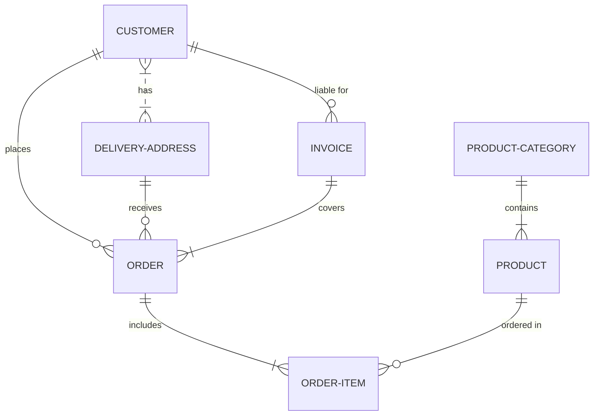

# Proyecto de Estudio

# PRESENTACIÓN - PaqueExpress

**Asignatura**: Bases de Datos I (FaCENA-UNNE)

**Integrantes**:

- Arnica, Saul Agustin (L.U.: 60.457 – DNI: 43.205.368)
- Miño Gomez, Juan Daniel (L.U.: 58.033 – DNI: 38.963.397)
- Morales Lopez, Luana Belen (L.U.: 57.983 – DNI: 46.460.672)
- Navarro Acevedo, Sergio (L.U.: 55.679 – DNI: 43.063.333)

**Año**: 2025

## CAPÍTULO I: INTRODUCCIÓN

### Caso de estudio

El presente trabajo práctico se centra en el diseño e implementación de un sistema de gestión de envíos de paquetería. Este sistema tiene como propósito controlar, registrar y mantener información relativa a paquetes, clientes, rutas, vehículos, conductores y sucursales, facilitando la trazabilidad de cada envío desde su registro hasta su entrega.

El tema se enfoca en la optimización de los procesos de envío y seguimiento dentro de una empresa de transporte de paquetes, garantizando la integridad y consistencia de los datos.

### Definición o planteamiento del problema

En las empresas de transporte de paqueteria, uno de los principales problemas es la falta de un sistema centralizado que permita gestionar de manera eficiente los envios. La informacion sobre paquetes, rutas, vehiculos y conductores a menudo se encuentra dispersa o registrada manualmente, lo que genera errores, retrasos y dificultades para hacer seguimiento de los envios. Este trabajo práctico plantea como problema: ¿Cómo diseñar una base de datos que permita controlar y registrar de manera eficiente toda la información relacionada con los envios de paqueteria, garantizando trazabilidad, integridad de datos y soporte para la toma de decisiones?

### Objetivo del Trabajo Práctico
El objetivo del trabajo práctico es desarrollar una base de datos que permita gestionar de manera eficiente los envíos de paquetes, controlando clientes, paquetes, rutas, vehículos, empleados y sucursales, y facilitando la consulta y generación de reportes sobre los procesos de envío.

### Objetivo Generales

Diseñar e implementar un sistema de base de datos que centralice la información de los envíos de paquetería, garantizando la integridad de los datos y la trazabilidad de cada paquete.

### Objetivos Específicos

Registrar y mantener información detallada sobre clientes, paquetes, rutas, vehículos, conductores y sucursales.
Controlar los estados de los paquetes (Pendiente, En tránsito, Entregado, Retrasado) y facilitar el seguimiento de los envíos.
Permitir consultas y generación de reportes que ayuden a la planificación y gestión de los envíos.

## CAPITULO II: MARCO CONCEPTUAL O REFERENCIAL

**TEMA 1 " ---- "**

**TEMA 2 " ----- "**

...

## CAPÍTULO III: METODOLOGÍA SEGUIDA

**Aca va una intro ma o meno**

**a) Cómo se realizó el Trabajo Práctico**

**b) Herramientas (Instrumentos y procedimientos)**

## CAPÍTULO IV: DESARROLLO DEL TEMA / PRESENTACIÓN DE RESULTADOS

### Diagrama conceptual (opcional)

Ejemplo usando Live Editor https://mermaid.js.org/ (ejemplo opcional)

### Diagrama relacional

### Diccionario de datos

Acceso al documento [PDF](doc/diccionario_datos.pdf) del diccionario de datos.

### Desarrollo TEMA 1 "----"

Fusce auctor finibus lectus, in aliquam orci fermentum id. Fusce sagittis lacus ante, et sodales eros porta interdum. Donec sed lacus et eros condimentum posuere.

> Acceder a la siguiente carpeta para la descripción completa del tema [scripts-> tema_1](script/tema01_nombre_tema)

### Desarrollo TEMA 2 "----"

Proin aliquet mauris id ex venenatis, eget fermentum lectus malesuada. Maecenas a purus arcu. Etiam pellentesque tempor dictum.

> Acceder a la siguiente carpeta para la descripción completa del tema [scripts-> tema_2](script/tema02_nombre_tema)

...

## CAPÍTULO V: CONCLUSIONES

## BIBLIOGRAFÍA DE CONSULTA

1.  List item
2.  List item
3.  List item
4.  List item
5.  List item
